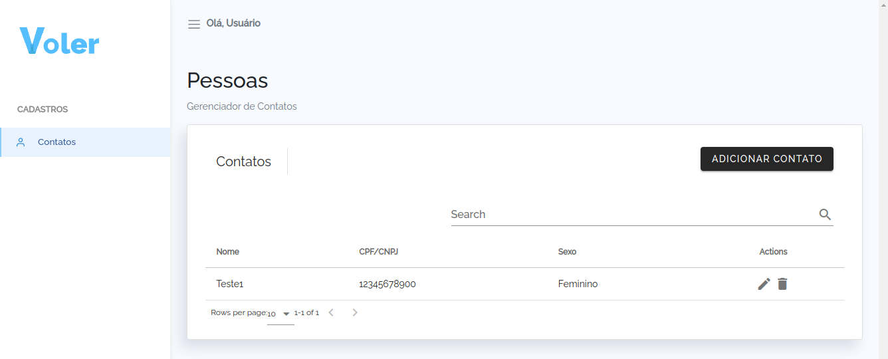

# App


## Como utilizar


* Necessário Docker instalado;
* Fazer o download ou clone do projeto;
* Acessar o diretório do projeto;
* Executar o comando `docker-compose up -d`
* `docker exec app composer install`
* `cp .env.example .env`
* `docker-compose exec app php artisan key:generate`
* `docker-compose exec app php artisan migrate` 

Altere o arquivo `.env` com as variévies do banco de dados:

```env
DB_CONNECTION=mysql
DB_HOST=db
DB_PORT=3306
DB_DATABASE=laravel
DB_USERNAME=root
DB_PASSWORD=root
```

As demais variáveis não precisar alterações.


Feito isso acesse:

Para o PHPMyAdmin: `http://localhost:13306/`

Para a aplicação: `http://localhost`


## Tela Inicial do app




